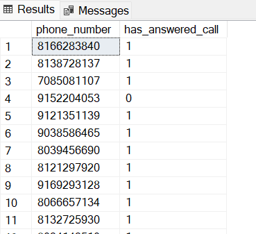

# my-data-project
A data analysis project for Loan Management and Recovery

![Excel-to-PowerBi-animated-diagram]


# Table of contents
- [Project Overview](#Project-Overview)
- [Objective](#objective)
- [Expected Outcome](#Expected-outcome)
- [Data Source](#data-source)
- [Stages](#stages)
- [Design](#design)
- [Tools](#tools)


# Project Overview
In today's financial landscape, loan agencies must leverage data analytics to optimize decision-making and improve operational efficiency. This project explores the application of data analytics in loan management, focusing on how data-driven insights can enhance credit risk assessment, loan approval processes, and customer repayment behavior.

This study will use real-world loan datasets to analyze key trends, risk factors, and predictive models to help financial institutions make informed lending decisions.

By aligning with the **DIK (Data-Information-Knowledge)** pyramid, this project aims to transform raw loan data into valuable insights that can improve risk mitigation, enhance customer segmentation, and optimize loan recovery strategies.

# Objective
1. Develop and analyze key research questions related to credit risk assessment, loan approvals, and repayment behavior.
2. Apply data analytics techniques to extract actionable insights from loan datasets.
3. Identify trends and key performance indicators (KPIs) that impact loan repayment and default rates.
4. Predictive analytics and anomaly detection enhance loan risk evaluation and fraud detection.
5. Provide data-driven recommendations to optimize lending strategies, improve debt recovery, and increase customer retention.

## User story
As the Lead Data Analyst, I have been tasked with analyzing call center records related to debtors to assess how call outcomes influence loan repayments. This project involves building a comprehensive Power BI dashboard that serves as both an analytical and reporting tool.

Key objectives include:

**Measuring repayment performance** across various borrower segments

**Assessing the impact of answered vs. unanswered calls** on loan recovery

**Performing demographic analysis** (such as location, occupation, and age group) to identify borrower profiles most likely to repay

**Highlighting key metrics and repayment trends** to support strategy formulation

With this data-driven approach, I aim to empower the loan agency with actionable insights that improve recovery strategies, optimize resource allocation, and ultimately increase repayment rates.

# Expected Outcome
By the end of this project, the findings will highlight the critical role of data analytics in loan management, showcasing how loan agencies can leverage data-driven insights to enhance decision-making, minimize financial risks, and improve overall loan portfolio performance.

# Data Source
- What data is needed to achieve our objective?

We need two sets of data:
1. Data obtained from the call centre
2. Data containing details of debtors like:
   - Name of loanee
   - amount loaned
   - amount to repay
   - Disbursement date
   - occupation
   - state
   - customer type
   - phone number
   and other details to aid in-depth analysis

- Where is the data coming from?
The data is sourced from a call center agency that helps make calls for loan companies like Fairmoney. The dataset containing debtor details is obtained from Fairmoney Company.

# Stages
- Design
- Development
- Testing
- Analysis

# Design
## Dashboard components required
- What should the dashboard contain based on the requirements provided?

To understand what it should contain, we need to find out what questions we need the dashboard to answer:

1. Call engagement impact
2. Repayment performance
3. Customer outreach effectiveness
4. Loan recovery opportunities
5. Temporal Trends(Impact of outreach over time)
6. Segmentation Analysis(repayment behaviour by state, occupation, customer type)

## Tools

| Tool | Purpose |
| --- | --- |
| Excel | Exploring the data |
| SQL Server | Cleaning, testing, and analyzing the data |
| Power BI | Visualizing the data by creating interactive dashboards |
| Python | For predictive analysis |
| GitHub | Hosting, and documentation of the  project |

# Development

## Pseudocode

- What's the general approach in creating this solution from start to finish?

1. Get the data
2. Explore the data in Excel
3. Load the data into SQL Server
4. Clean the data with SQL queries
5. Test the data with SQL queries
6. Visualize the data in Power BI
7. Generate the findings based on the insights derived
8. Documentation
9. Publish data

## Data Exploration Notes

During the data exploration stage, I scan the data to look for errors, data inconsistencies, bugs, and irregularities

- What are the observations with the dataset?

1. **Multiple Call Attempts**: Several phone numbers appeared with different call statuses such as Answered, Busy, Congested, and Not Answered, indicating that debtors were contacted multiple times in attempts to reach them.
2. **Inconsistent State Entries**: The State column contained inconsistencies, including misspelled state names and irregular capitalization, which could affect data accuracy and analysis.
3. **Phone Number Format Mismatch**: The phone numbers in both tables were recorded in different formats. For effective data integration and to enable accurate joins using SQL, it is essential to standardize the phone number format across both datasets.

## Data Cleaning
It is expected that I clean the data of all its inconsistencies and irregularities

The cleaned data is expected to meet the following criteria
- Phone number format consistency
- State column standardization
- Call statsus simplification
- Date column validation
- Numeric fields validation (amount_disbursed, amount_repaid, total_outstanding_amount)
- Unique identifiers and joins
- Consistent categorical values

- What steps are needed to clean the data and shape it into the desired format?

  1. Clean phone numbers for joining
  2. Standardize state name (Use a reference list of valid Nigerian states)
  3. Normalize call status
  4. Ensure date format consistency
  5. Fix categorical values
  6. Remove or flag incomplete or inaccurate rows

### Transform the data
```sql
/** Ensuring standardized naming of state**/
UPDATE dbo.fairmoney_details
SET state = UPPER(LEFT(state,1)) + LOWER(SUBSTRING(state,2,len(state)));
```
### Create the SQL View
```sql
/** Create a Temporary view with distinct call status per phone**/
WITH distinct_calls AS (
	SELECT
		fc.phone_number,
		MAX(CASE WHEN call_status = 'answered' THEN 1 ELSE 0 END) AS has_answered_call
	FROM fairmoney_call fc
	GROUP BY fc.phone_number
)
SELECT * FROM distinct_calls;
```
### Output

### Customer Segmentation
