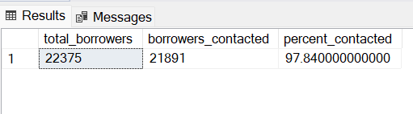
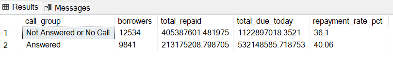
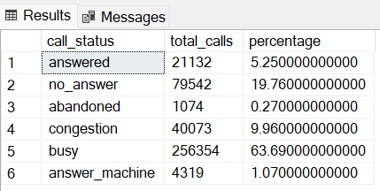
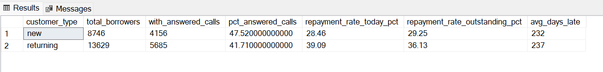
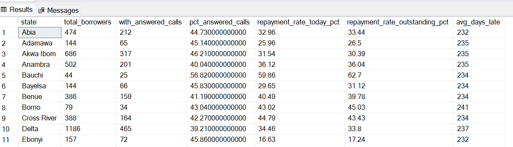
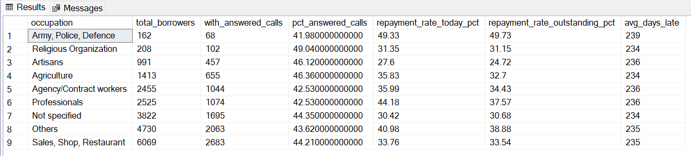
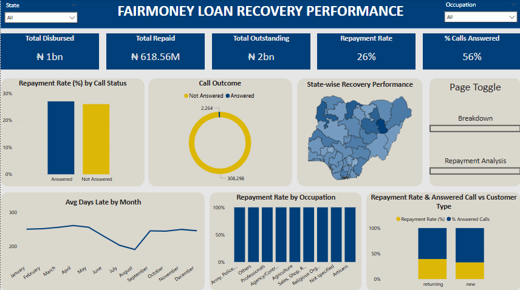
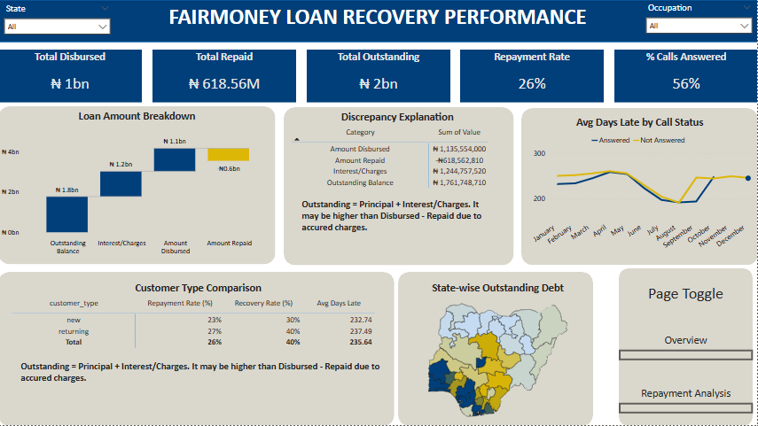
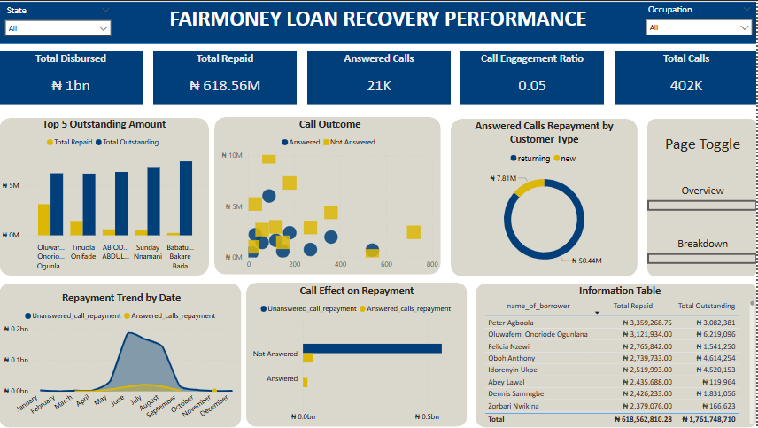

# my-data-project
A data analysis project for Loan Management and Recovery

![Excel-to-PowerBi-animated-diagram]


# Table of contents
- [Project Overview](#Project-Overview)
- [Objective](#objective)
- [Expected Outcome](#Expected-outcome)
- [Data Source](#data-source)
- [Stages](#stages)
- [Design](#design)
  - [Tools](#tools)
- [Development](#development)
  - [Pseudocode](#pseudocode)
  - [Data Exploration Notes](#data-exploration)
  - [Data Cleaning](#data-cleaning)
  - [Transform the Data](#transform-the-data)
  - [Create the SQL View](#create-the-sql-view)
- [Visualization](#visualization)
  - [Results](#results)
  - [DAX Measures](#dax-measures)
- [Analysis](#analysis)
  - [Findings](#findings)
  - [Interpretation](#interpretation)
- [Recommendations](#recommendations)
  


# Project Overview
In today's financial landscape, loan agencies must leverage data analytics to optimize decision-making and improve operational efficiency. This project explores the application of data analytics in loan management, focusing on how data-driven insights can enhance credit risk assessment, loan approval processes, and customer repayment behavior.

This study will use real-world loan datasets to analyze key trends, risk factors, and predictive models to help financial institutions make informed lending decisions.

By aligning with the **DIK (Data-Information-Knowledge)** pyramid, this project aims to transform raw loan data into valuable insights that can improve risk mitigation, enhance customer segmentation, and optimize loan recovery strategies.

# Objective
1. Develop and analyze key research questions related to credit risk assessment, loan approvals, and repayment behavior.
2. Apply data analytics techniques to extract actionable insights from loan datasets.
3. Identify trends and key performance indicators (KPIs) that impact loan repayment and default rates.
4. Predictive analytics and anomaly detection enhance loan risk evaluation and fraud detection.
5. Provide data-driven recommendations to optimize lending strategies, improve debt recovery, and increase customer retention.

## User story
As the Lead Data Analyst, I have been tasked with analyzing call center records related to debtors to assess how call outcomes influence loan repayments. This project involves building a comprehensive Power BI dashboard that serves as both an analytical and reporting tool.

Key objectives include:

**Measuring repayment performance** across various borrower segments

**Assessing the impact of answered vs. unanswered calls** on loan recovery

**Performing demographic analysis** (such as location, occupation, and age group) to identify borrower profiles most likely to repay

**Highlighting key metrics and repayment trends** to support strategy formulation

With this data-driven approach, I aim to empower the loan agency with actionable insights that improve recovery strategies, optimize resource allocation, and ultimately increase repayment rates.

# Expected Outcome
By the end of this project, the findings will highlight the critical role of data analytics in loan management, showcasing how loan agencies can leverage data-driven insights to enhance decision-making, minimize financial risks, and improve overall loan portfolio performance.

# Data Source
- What data is needed to achieve our objective?

We need two sets of data:
1. Data obtained from the call centre
2. Data containing details of debtors like:
   - Name of loanee
   - amount loaned
   - amount to repay
   - Disbursement date
   - occupation
   - state
   - customer type
   - phone number
   and other details to aid in-depth analysis

- Where is the data coming from?
The data is sourced from a call center agency that helps make calls for loan companies like Fairmoney. The dataset containing debtor details is obtained from Fairmoney Company.

# Stages
- Design
- Development
- Testing
- Analysis

# Design
## Dashboard components required
- What should the dashboard contain based on the requirements provided?

To understand what it should contain, we need to find out what questions we need the dashboard to answer:

1. Call engagement impact
2. Repayment performance
3. Customer outreach effectiveness
4. Loan recovery opportunities
5. Temporal Trends(Impact of outreach over time)
6. Segmentation Analysis(repayment behaviour by state, occupation, customer type)

## Tools

| Tool | Purpose |
| --- | --- |
| Excel | Exploring the data |
| SQL Server | Cleaning, testing, and analyzing the data |
| Power BI | Visualizing the data by creating interactive dashboards |
| Python | For predictive analysis |
| GitHub | Hosting, and documentation of the  project |

# Development

## Pseudocode

- What's the general approach in creating this solution from start to finish?

1. Get the data
2. Explore the data in Excel
3. Load the data into SQL Server
4. Clean the data with SQL queries
5. Test the data with SQL queries
6. Visualize the data in Power BI
7. Generate the findings based on the insights derived
8. Documentation
9. Publish data

## Data Exploration Notes

During the data exploration stage, I scan the data to look for errors, data inconsistencies, bugs, and irregularities

- What are the observations with the dataset?

1. **Multiple Call Attempts**: Several phone numbers appeared with different call statuses such as Answered, Busy, Congested, and Not Answered, indicating that debtors were contacted multiple times in attempts to reach them.
2. **Inconsistent State Entries**: The State column contained inconsistencies, including misspelled state names and irregular capitalization, which could affect data accuracy and analysis.
3. **Phone Number Format Mismatch**: The phone numbers in both tables were recorded in different formats. For effective data integration and to enable accurate joins using SQL, it is essential to standardize the phone number format across both datasets.

## Data Cleaning
It is expected that I clean the data of all its inconsistencies and irregularities

The cleaned data is expected to meet the following criteria
- Phone number format consistency
- State column standardization
- Call statsus simplification
- Date column validation
- Numeric fields validation (amount_disbursed, amount_repaid, total_outstanding_amount)
- Unique identifiers and joins
- Consistent categorical values

- What steps are needed to clean the data and shape it into the desired format?

  1. Clean phone numbers for joining
  2. Standardize state name (Use a reference list of valid Nigerian states)
  3. Normalize call status
  4. Ensure date format consistency
  5. Fix categorical values
  6. Remove or flag incomplete or inaccurate rows

### Transform the data
```sql
/** Ensuring standardized naming of state**/
UPDATE dbo.fairmoney_details
SET state = UPPER(LEFT(state,1)) + LOWER(SUBSTRING(state,2,len(state)));
```
### Create the SQL View
```sql
/** Create a Temporary view with distinct call status per phone**/
WITH distinct_calls AS (
	SELECT
		fc.phone_number,
		MAX(CASE WHEN call_status = 'answered' THEN 1 ELSE 0 END) AS has_answered_call
	FROM fairmoney_call fc
	GROUP BY fc.phone_number
)
SELECT * FROM distinct_calls;
```
### Output


### Borrowers who received at least one call
```sql
/** %age of Borrowers who received at least one call**/
SELECT
	COUNT(DISTINCT fd.phone_number) AS total_borrowers,
	COUNT(DISTINCT fc.phone_number) AS borrowers_contacted,
    ROUND(
        COUNT(DISTINCT fc.phone_number) * 100.0 / COUNT(DISTINCT fd.phone_number), 2
    ) AS percent_contacted
FROM fairmoney_details fd
LEFT JOIN fairmoney_call fc ON fd.phone_number = fc.phone_number;
```
### Output


### Repayment Rate
```sql
-- Combine borrower data with whether they had answered calls
WITH distinct_calls AS (
    SELECT 
        phone_number,
        MAX(CASE WHEN call_status = 'answered' THEN 1 ELSE 0 END) AS has_answered_call
    FROM fairmoney_call
    GROUP BY phone_number
)

SELECT 
    CASE 
        WHEN COALESCE(dc.has_answered_call, 0) = 1 THEN 'Answered'
        ELSE 'Not Answered or No Call'
    END AS call_group,
    COUNT(DISTINCT fd.phone_number) AS borrowers,
    SUM(fd.amount_repaid) AS total_repaid,
    SUM(fd.amount_to_repay_today) AS total_due_today,
    ROUND(SUM(fd.amount_repaid) * 100.0 / NULLIF(SUM(fd.amount_to_repay_today), 0), 2) AS repayment_rate_pct
FROM fairmoney_details fd
LEFT JOIN distinct_calls dc ON fd.phone_number = dc.phone_number
GROUP BY COALESCE(dc.has_answered_call, 0);
```
### Output


### Call Distribution Status
```sql
SELECT 
    call_status,
    COUNT(*) AS total_calls,
    ROUND(COUNT(*) * 100.0 / SUM(COUNT(*)) OVER (), 2) AS percentage
FROM fairmoney_call
GROUP BY call_status;
```
### Output


### Customer Segmentation
```sql
WITH distinct_calls AS (
    SELECT 
        phone_number,
        MAX(CASE WHEN LOWER(call_status) = 'answered' THEN 1 ELSE 0 END) AS has_answered_call
    FROM fairmoney_call
    GROUP BY phone_number
)

SELECT 
    fd.customer_type,
    COUNT(DISTINCT fd.phone_number) AS total_borrowers,
    COUNT(DISTINCT CASE WHEN COALESCE(dc.has_answered_call, 0) = 1 THEN fd.phone_number END) AS with_answered_calls,
    ROUND(COUNT(DISTINCT CASE WHEN COALESCE(dc.has_answered_call, 0) = 1 THEN fd.phone_number END) * 100.0 / NULLIF(COUNT(DISTINCT fd.phone_number), 0), 2) AS pct_answered_calls,

    -- Repayment
    ROUND(SUM(fd.amount_repaid) * 100.0 / NULLIF(SUM(fd.amount_to_repay_today), 0), 2) AS repayment_rate_today_pct,
    ROUND(SUM(fd.amount_repaid) * 100.0 / NULLIF(SUM(fd.total_outstanding_amount), 0), 2) AS repayment_rate_outstanding_pct,

    -- Lateness
    ROUND(AVG(fd.days_late), 2) AS avg_days_late

FROM fairmoney_details fd
LEFT JOIN distinct_calls dc ON fd.phone_number = dc.phone_number
GROUP BY fd.customer_type
ORDER BY fd.customer_type;
```
### Output


### State Segmentation
```sql
WITH distinct_calls AS (
    SELECT 
        phone_number,
        MAX(CASE WHEN LOWER(call_status) = 'answered' THEN 1 ELSE 0 END) AS has_answered_call
    FROM fairmoney_call
    GROUP BY phone_number
)

SELECT 
    fd.state,
    COUNT(DISTINCT fd.phone_number) AS total_borrowers,
    COUNT(DISTINCT CASE WHEN COALESCE(dc.has_answered_call, 0) = 1 THEN fd.phone_number END) AS with_answered_calls,
    ROUND(COUNT(DISTINCT CASE WHEN COALESCE(dc.has_answered_call, 0) = 1 THEN fd.phone_number END) * 100.0 / NULLIF(COUNT(DISTINCT fd.phone_number), 0), 2) AS pct_answered_calls,

    -- Repayment
    ROUND(SUM(fd.amount_repaid) * 100.0 / NULLIF(SUM(fd.amount_to_repay_today), 0), 2) AS repayment_rate_today_pct,
    ROUND(SUM(fd.amount_repaid) * 100.0 / NULLIF(SUM(fd.total_outstanding_amount), 0), 2) AS repayment_rate_outstanding_pct,

    -- Lateness
    ROUND(AVG(fd.days_late), 2) AS avg_days_late

FROM fairmoney_details fd
LEFT JOIN distinct_calls dc ON fd.phone_number = dc.phone_number
GROUP BY fd.state
ORDER BY fd.state;
```
### Output


### Occupation Segmentation
```sql
WITH distinct_calls AS (
    SELECT 
        phone_number,
        MAX(CASE WHEN LOWER(call_status) = 'answered' THEN 1 ELSE 0 END) AS has_answered_call
    FROM fairmoney_call
    GROUP BY phone_number
)

SELECT 
    fd.occupation,
    COUNT(DISTINCT fd.phone_number) AS total_borrowers,
    COUNT(DISTINCT CASE WHEN COALESCE(dc.has_answered_call, 0) = 1 THEN fd.phone_number END) AS with_answered_calls,
    ROUND(COUNT(DISTINCT CASE WHEN COALESCE(dc.has_answered_call, 0) = 1 THEN fd.phone_number END) * 100.0 / NULLIF(COUNT(DISTINCT fd.phone_number), 0), 2) AS pct_answered_calls,

    -- Repayment
    ROUND(SUM(fd.amount_repaid) * 100.0 / NULLIF(SUM(fd.amount_to_repay_today), 0), 2) AS repayment_rate_today_pct,
    ROUND(SUM(fd.amount_repaid) * 100.0 / NULLIF(SUM(fd.total_outstanding_amount), 0), 2) AS repayment_rate_outstanding_pct,

    -- Lateness
    ROUND(AVG(fd.days_late), 2) AS avg_days_late

FROM fairmoney_details fd
LEFT JOIN distinct_calls dc ON fd.phone_number = dc.phone_number
GROUP BY fd.occupation
ORDER BY total_borrowers asc;
```
### Output


# Visualization

## Results
- What does the dashboard look like?
  
  
- This gives an overview of the FairMoney debtors, showing the total disbursed amount, total repaid, total outstanding, repayment rate, %calls answered, state wise recovery performance, call outcome by call status, Repayment rate(%) by call status, Avg days Late by Month, Repayment rate by Occupation, Repayment rate & answered call vs customer type.


 
 
- This gives the discrepancy explanation, customer type comparison, loan amount breakdown, state-wise outstanding debt, Avg days late by call status


 
 
- This goes further to show the top 5 outstanding debtors by amount, call outcome by repayment, answered calls by customer type, repayment trend date, call effect on repayment, and an information table.

These interactive dashboards allow users to drill deeper into the data, enabling more detailed analysis and supporting stronger, data-driven decision-making.

## Dax Measures

### 1. Answered Calls (%)
```sql
% Answered Calls = 
VAR AnsweredCount =
    CALCULATE(
        DISTINCTCOUNT(fairmoney_call[phone_number]),
        fairmoney_call[call_status] = "answered"
    )
VAR TotalCount =
    CALCULATE(
        DISTINCTCOUNT(fairmoney_details[phone_number])
    )
RETURN
DIVIDE(AnsweredCount, TotalCount, 0)
```

### 2. Call engagement ratio
```sql
Call_Engagement_Ratio = 
DIVIDE(
    [Answered_Calls],
    [Total_Calls],
    BLANK()
)
```

### 3. Discrepancy
```sql
Discrepancy = [Total Repaid] + [Total Outstanding] - [Total Disbursed]
```

### 4. Recovery Rate
```sql
Recovery Rate (%) = 
ROUND(DIVIDE(
    SUM(fairmoney_details[amount_repaid]),
    SUM(fairmoney_details[total_outstanding_amount]),
    0
),
1
)
```

### 5. Repayment Rate
```sql
Repayment Rate (%) = 
VAR Repaid = SUM(fairmoney_details[amount_repaid])
VAR Outstanding = SUM(fairmoney_details[total_outstanding_amount])
VAR TotalToRepay = Repaid + Outstanding
RETURN
ROUND(
    DIVIDE(Repaid, TotalToRepay, 0),
    2
)
```

### 6. Total Calls
```sql
Total_Calls = COUNT(fairmoney_call[phone_Number])

```

### 7. Total Repaid
```sql
Total Repaid = sum(fairmoney_details[amount_repaid])
```

### 8. Total Outstanding
```sql
Total Outstanding = SUM(fairmoney_details[total_outstanding_amount])
```

### 9. Total Disbursed
```sql
Total Disbursed = sum(fairmoney_details[amount_disbursed])
```

# Analysis

## Findings

- What was discovered?

  
Key Insights from FairMoney Loan Repayment Analysis


**Loan Disbursement Overview**

  
Total Disbursed: ₦1,000,000,000

Total Repaid: ₦618,560,000

Total Outstanding: ₦2,000,000,000

Overall Repayment Rate: 26%

**Call Engagement Metrics**


% Calls Answered: 0.73% (2,264 calls)

% Calls Not Answered: 99.27% (308,298 calls)

**Repayment Rate by Call Status**


Answered Calls: 27%

Unanswered Calls: 26%

**Repayment Rate by Occupation**


Ranges between 20% to 33%, depending on the borrower's occupation.

**Customer Segmentation**


Returning Customers:

% Calls Answered: 42%

Repayment Rate: 27%

New Customers:

% Calls Answered: 48%

Repayment Rate: 23%

**Call Status vs. Repayment Value**


Repayment When Status = Not Answered:

Unanswered Calls: ₦560,311,533.66

Eventually Answered (but initially 'Not Answered'): ₦40,290,960.27

Repayment When Status = Answered: ₦17,960,316.36

## Interpretation

- **Interpretation and Key Takeaways**

**1. Low Call Engagement Despite High Outreach**

99.27% of calls were not answered, suggesting low engagement with the loan recovery call efforts.

This raises concerns about the effectiveness of the call center strategy and suggests the need to explore alternative or complementary contact methods (e.g., SMS, WhatsApp, in-app notifications).

**2. Minimal Difference in Repayment Rates by Call Status**

Answered calls have only a slightly higher repayment rate (27%) compared to unanswered calls (26%).

This implies that calls alone may not be the strongest driver of repayment behavior and may need to be combined with other behavioral nudges or incentives.

**3. Repayment Still Occurs Even Without Answering Calls**

Unanswered calls accounted for ₦560M+ in repayment, far outweighing the ₦18M recovered from answered calls.

Some borrowers repay regardless of call engagement, possibly due to prior commitments or automated deductions, hinting at self-driven repayment behavior.

**4. Customer Type Influences Behavior**

Returning customers show slightly better behavior than new ones:

Higher call answer rates (42% vs. 48% for new)

Higher repayment rate (27% vs. 23%)

This suggests that relationship history influences trust and repayment commitment, and returning customers may be more reliable.

**5. Occupation Plays a Role in Repayment**

Repayment rates by occupation range from 20% to 33%, indicating potential for targeted risk assessment.

Some professions may have more predictable income and could represent lower-risk borrowers.

# Recommendations

- **Enhance Contact Strategies:**

Explore omnichannel reminders (SMS, email, WhatsApp) to supplement phone calls.

Consider the timing and frequency of calls for better engagement.

- **Profile-Based Risk Scoring:**

Use occupation and customer type to refine loan eligibility and follow-up strategies.

- **Invest in Returning Customers:**

Develop loyalty or incentive schemes for repeat borrowers who show higher repayment behavior.

- **Reassess Call Center ROI:**

Given the marginal impact on repayment, re-evaluate the cost-effectiveness of call center operations.

- **Clean and Standardize Data:**

Ensure phone numbers are consistent for accurate joins and tracking.

Standardize state names to improve segmentation and location-based analysis.
